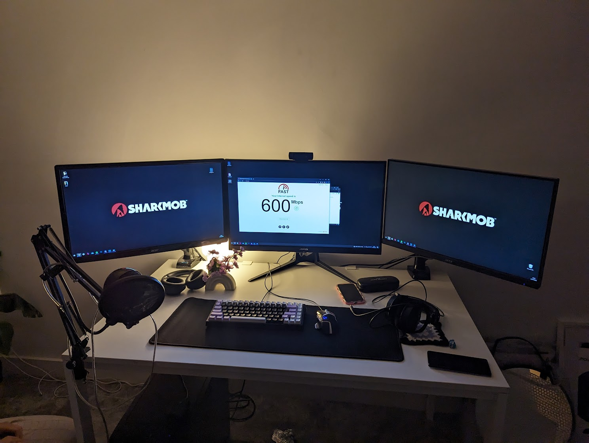

I recently moved to a new place with my partner and we decided to rely on WiFi for our internet connectivity instead of running cables from the router to our offices. This meant that we had to get PCIe WiFi cards for our desktop computers. I got a set of Intel AX210 cards for us both.

Mine was great from the get-go, my partner was not so lucky however. 
The connection speed was fast when we first set it up, however, when she went to work the next morning,
the card struggled to even connect to the network. I tried turning the antennas in various directions because I found that
to work on my own card when I ran into speed issues but it was no use.

I initially chalked it up as a hardware defect and ordered a replacement card. The same thing happened.
We installed the card, ran an initial test that went great, then she would sit down to work and the card would struggle to connect to the network. She has a triple-monitor setup and a graphics card with 3 display ports, 1 of HDMI, DisplayPort (DP) and DVI. 
While I went grocery shopping, she jokingly thought to disconnect one of the monitors to see if it made a difference.

I didn't believe her when she told me the news.

It went something like this:
- 1 monitor = 650Mbps
- 2 monitors = 350Mbps
- 3 monitors = wouldn't even connect to the network

This explained why the initial testing always went well. I never bothered to power on the other screens when I just installed the network card.

Initially we thought the issue was power related because we had the card installed in a 16x slot - but moving it to a 2x slot made no difference. We did some research and found that [it could be related to electromagnetic interference](https://forums.tomshardware.com/threads/my-pc-monitor-is-somehow-making-my-internet-connection-drop-all-the-time-why-is-that.2648321/).

We tried insulating the DVI cable with foil to create a faraday cage but it made very little difference. My partner stumbled upon [a Reddit thread](https://old.reddit.com/r/techsupport/comments/egmtki/using_second_monitor_slows_internet_download/) that would explain all our issues.

> A ferrite bead (also known as a ferrite block, ferrite core, ferrite ring, EMI filter, or ferrite choke) is a type of choke that suppresses high-frequency electronic noise in electronic circuits
>
> From [Ferrite bead, Wikipedia](https://en.wikipedia.org/wiki/Ferrite_bead).

Intrigued by this thing we'd never heard of before, my partner looked at my bag of cables and said "hey that one has a ferrite on it, let's try it!". 

It worked. How many evenings have you lost to electromagnetic interference?

Let me know in the comments below.


If you want to read more fun articles like these, consider subscribing to [my RSS feed](/index.xml)!


